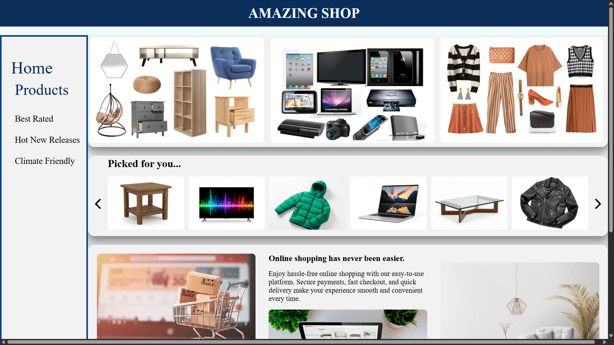
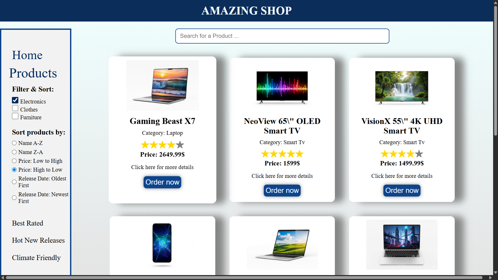

In progress ...

# 🛍️ E-Commerce Frontend (React + Firebase)

## 📌 Overview  
This project is a simple e-commerce frontend built with **React**, styled with **CSS/Tailwind**, and powered by **Firebase Firestore** for product data.  
It supports browsing, filtering, and sorting products, along with extra features like ratings, eco-friendly filtering, and energy efficiency levels.

---

## ✨ Features  
- 🔍 Product filtering by category (electronics, clothes, furniture, etc.)  
- ⭐ Best Rated products (top 9 by user rating)  
- 🆕 Hot New Releases (latest 9 by release date)  
- 🌱 Climate Pledge Friendly filter (eco-friendly products)  
- ⚡ Energy efficiency levels (A, B, C) with color-coded display  
- 🔎 Search bar for products  
- 📊 Sorting by name, price, and release date  
- 📱 Responsive layout  

---

## 🚀 Tech Stack  
- **Frontend:** React, React Router  
- **State Management:** React hooks (`useState`, `useEffect`, `useContext`)  
- **Backend/Database:** Firebase Firestore  
- **Styling:** CSS / Tailwind (optional extensions)  
- **Icons:** React Icons (`react-icons`)  

---

## 📸 Screenshots

    
    

---

## ⚙️ Installation & Setup  

1. Clone the repository:  

   git clone https://github.com/MikeMikeRx/Shopping-website.git

2. Install dependecies:

    npm install

3. Set up Firebase:

    src/firebase/config.js

4. Run the development server:

    npm start